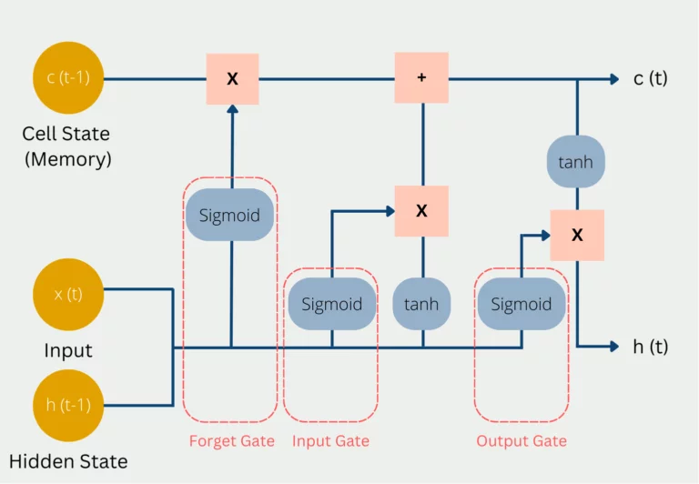
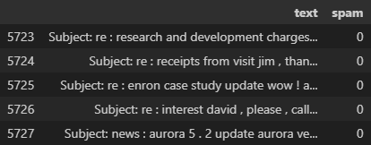
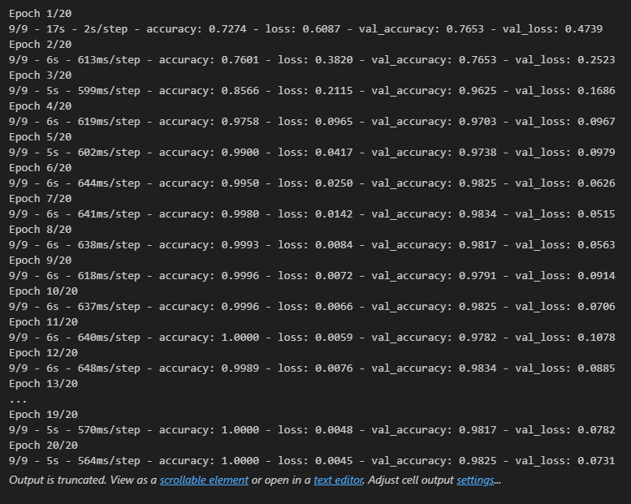
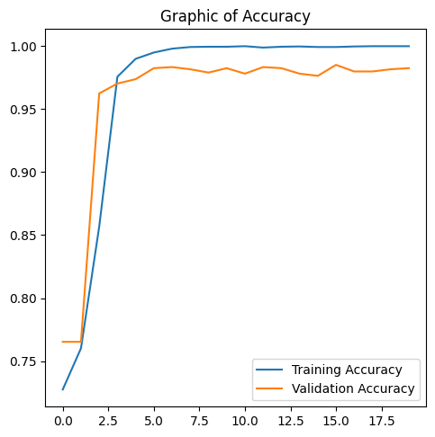
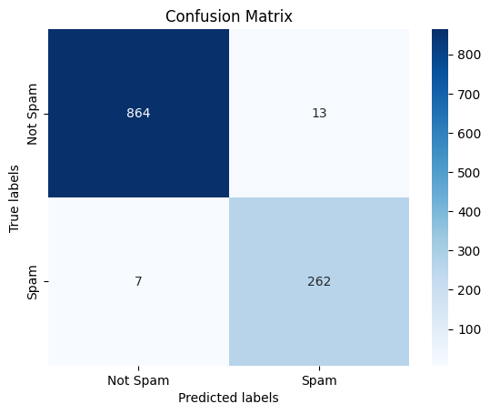

# Email Spam Detection using NLP

In this project, I create a *state-of-the-art* python program for detecting spam in email using Natural Language Processing (NLP). I create this program for completing online learning classes with Dicoding Indonesia. The dataset consists of the email text and its label (1=spam, 0=not spam/ham). This program uses TensorFlow to create a Machine Learning model for NLP. First of all, I split the dataset into training and testing with a ratio of 80%: to 20%. The raw data is cleaned, converted into the sequence of tokens, and then made the same size using padding.

For the Machine Learning model, we use 2 layers of bidirectional LSTM (Long Short Term Memory), 2 hidden layers, an input layer, and an output layer. The LSTM model is well-suited for NLP tasks because of its ability to process sequential data. LSTM can store long-term information from the previous state, so the model can learn the context of the data. In the input layer, I implement embedding that converts sequence text data into a vector of numerical values. The output is the numerical value between 0-1, so I use the sigmoid activation function. To evaluate the model, I use performance metrics that measure precision and recall.

## Long Short-Term Memory (LSTM)

**Long Short-Term Memory** is an improved version of recurrent neural network. **LSTM** is well-suited for sequence prediction tasks and excels in capturing long-term dependencies. A traditional RNN has a single hidden state that is passed through time, which can make it difficult for the network to learn long-term dependencies. LSTMs address this problem by introducing a memory cell, which is a container that can hold information for an extended period. LSTM networks are capable of learning long-term dependencies in sequential data, which makes them well-suited for tasks such as language translation, speech recognition, and time series forecasting. LSTMs can also be used in combination with other neural network architectures, such as Convolutional Neural Networks (CNNs) for image and video analysis.

**Bidirectional LSTM (Bi LSTM/ BLSTM)** is recurrent neural network (RNN) that is able to process sequential data in both forward and backward directions. This allows Bi LSTM to learn longer-range dependencies in sequential data than traditional LSTMs, which can only process sequential data in one direction.

- **Bi LSTMs** are made up of two LSTM networks, one that processes the input sequence in the forward direction and one that processes the input sequence in the backward direction. The outputs of the two LSTM networks are then combined to produce the final output.
- **Bi LSTM** have been shown to achieve state-of-the-art results on a wide variety of tasks, including machine translation, speech recognition, and text summarization.

LSTMs can be stacked to create deep LSTM networks, which can learn even more complex patterns in sequential data. Each LSTM layer captures different levels of abstraction and temporal dependencies in the input data. LSTM architecture has a chain structure that contains four neural networks and different memory blocks called **cells.**



Information is retained by the cells and the memory manipulations are done by the **gates.** There are three gates:

### Forget Gate

It is decided which current and previous information is kept and which is thrown out. This includes the hidden status from the previous pass and the current input. These values are passed into a sigmoid function, which can only output values between 0 and 1. The value 0 means that previous information can be forgotten because there is possibly new, more important information. The number one means accordingly that the previous information is preserved. The results from this are multiplied by the current Cell State so that knowledge that is no longer needed is forgotten since it is multiplied by 0 and thus dropped out.

### Input Gate

It is decided how valuable the current input is to solve the task. For this, the current input is multiplied by the hidden state and the weight matrix of the last run. All information that appears important in the Input Gate is then added to the Cell State and forms the new Cell State c(t). This new Cell State is now the current state of the long-term memory and will be used in the next run.

### Output Gate

The output of the LSTM model is then calculated in the Hidden State. Depending on the application, it can be, for example, a word that complements the meaning of the sentence. To do this, the sigmoid function decides what information can come through the output gate and then the cell state is multiplied after it is activated with the tanh function.

## Result

### Dataset



The dataset is a sample of 5728 emails, of which 1368 are spam. Each email is labeled with 0 (not spam) and 1 (spam). The dataset is split into data training (80%) and data testing (20%). Each word in the dataset is converted into a certain unique number, called a token. Then, the sequence of text data is converted into a vector of tokens.

### Model

```
# make machine learning model
import tensorflow as tf
from tensorflow.keras import regularizers
model = tf.keras.Sequential([
  # implement embedding
  tf.keras.layers.Embedding(10000, 64),
  # use 2 layer of bidirectional LSTM
  tf.keras.layers.Bidirectional(tf.keras.layers.LSTM(64,  return_sequences=True)),
  tf.keras.layers.Bidirectional(tf.keras.layers.LSTM(32)),
  tf.keras.layers.Dropout(0.5),
  tf.keras.layers.Dense(512, activation='relu',
                        kernel_regularizer=regularizers.l2(0.00001)),
  tf.keras.layers.Dropout(0.5),
  tf.keras.layers.Dense(512, activation='relu',
                        kernel_regularizer=regularizers.l2(0.00001)),
  tf.keras.layers.Dropout(0.5),
  tf.keras.layers.Dense(1, activation='sigmoid')
])
# implement dropout and regularizers function
```

I design the deep learning model using a combination of bidirectional LSTM and ANN. The model can train the dataset in both forward and backpropagation. I use bidirectional LSTM because of its ability to store long-term past information. So the model can learn more complex patterns in sequential data. For the ANN hidden layer, I use the relu activation function. Because of text input data, I implement embedding in the input layer. Embedding converts sequence text data into vectors of numerical values. I use the sigmoid activation function because the output value is between 0-1. It's a binary classification task, so we use binary cross entropy loss function with Adam optimizers.

### Training



The implemented model is trained using the input of a padded dataset with its label. We trained it with the number of epochs=20 and executed 512 batches per epoch. At the end of the training process, we get final accuracy and validation accuracy > 90%.

### Evaluation



From the graphic above, we can see that the model has high accuracy and is well-fitted. We get high accuracy in both the training and validation process. To ensure that the model is good enough to predict spam emails, we use performance metrics that measure precision and recall.



We can see that the false prediction of the model is just 20 from a total of 1.146 data trains (1,7452%). We also get high F1 scores (96,32%), precision (95,27%), and (97,4%) that indicate the result of the model is useful and complete.

### Predict

At the last, I use the trained model to predict the spam emails in my inbox. The result is that the model can predict that the email is spam with a score of 0,9.

## Source

**https://www.geeksforgeeks.org/deep-learning-introduction-to-long-short-term-memory/**

**https://databasecamp.de/en/ml/lstms**

**https://towardsdatascience.com/spam-detection-in-emails-de0398ea3b48**
